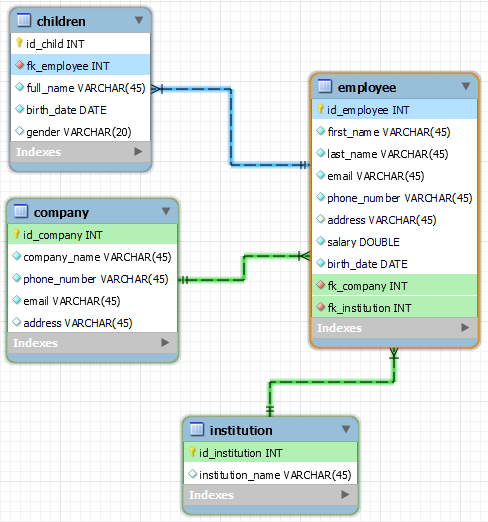
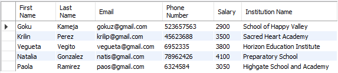
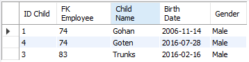
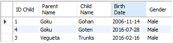
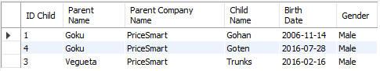

# Internship - JPA+Hibernate

This project is a demo of how to implement JPA using Hibernate.

## Challenge

1. Create the table institution that will have a relationship with the table employee
   (use foreign key), to show the studies from an employee. Take a screenshot from the
   new Entity-Relationship Diagram.

   

2. Use the JOIN clause to get the date from the tables institution and employee

   ```  
   SELECT
   e.first_name AS 'First Name',
   e.last_name AS 'Last Name',
   e.email AS 'Email',
   e.phone_number AS 'Phone Number',
   e.salary AS 'Salary',
   i.institution_name AS 'Institution Name'
   FROM employee e INNER JOIN institution i
   ON e.fk_institution = i.id_institution;
   ```
   
   

3. Use Sub-Queries to get the data from the children whose parents work in PriceSmart
   (id_company = 5). Note: Get the data only from the children table. 

   1. Option 1
   ```  
   SELECT
   id_child AS "ID Child",
   fk_employee AS 'FK Employee',
   full_name AS 'Child Name',
   birth_date AS 'Birth Date',
   gender AS 'Gender'
   FROM children
   WHERE fk_employee IN (
       SELECT id_employee FROM employee
       WHERE fk_company IN (
           SELECT id_company FROM company
           WHERE id_company = 5
       )
   );
   ```
   
   
   2. Option 2 
   ```  
   SELECT
   c.id_child AS "ID Child",
   e.first_name AS 'Parent Name',
   c.full_name AS 'Child Name',
   c.birth_date AS 'Birth Date',
   c.gender AS 'Gender'
   FROM children c INNER JOIN employee e
   ON c.fk_employee = e.id_employee
   WHERE c.fk_employee IN (
       SELECT id_employee FROM employee
       WHERE fk_company IN (
           SELECT id_company FROM company
           WHERE id_company = 5
       )
   );
   ```
   

   3. Option 3
   ```  
   SELECT
   c.id_child AS "ID Child",
   e.first_name AS 'Parent Name',
   co.company_name AS 'Parent Company Name',
   c.full_name AS 'Child Name',
   c.birth_date AS 'Birth Date',
   c.gender AS 'Gender'
   FROM children c INNER JOIN employee e
   ON c.fk_employee = e.id_employee
   INNER JOIN company co
   ON e.fk_company = co.id_company
   WHERE c.fk_employee IN (
       SELECT id_employee FROM employee
       WHERE fk_company IN (
           SELECT id_company FROM company
           WHERE id_company = 5
       )
   );
   ```
   

4. Create a Java program using JPA+Hibernate to create a database connection, where
   the user should be able to perform the following actions:
   1. Get all records from the table employee
   2. Get employees by last name from the table employee
   3. Insert a new record in the table employee
   4. Update a record in the table employee
   5. Delete a record in the table employee
   You can find a code example in [this repository](https://github.com/LuisaAcero2004/internship-jpa-hibernate)

   ### Run project

   ```
   mvn clean verify
   ```

   ### Allure reports
   ```
   allure serve
   ```
   